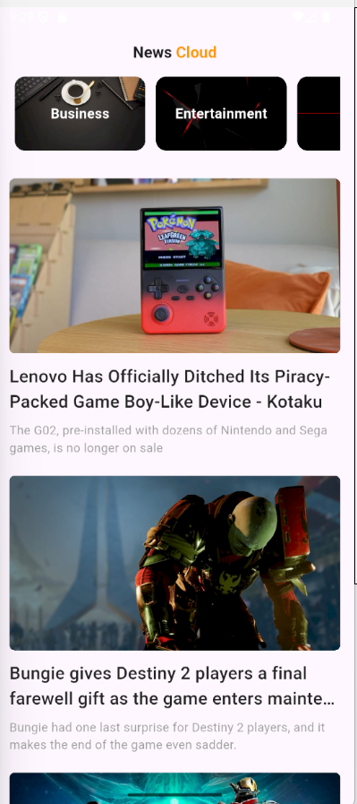
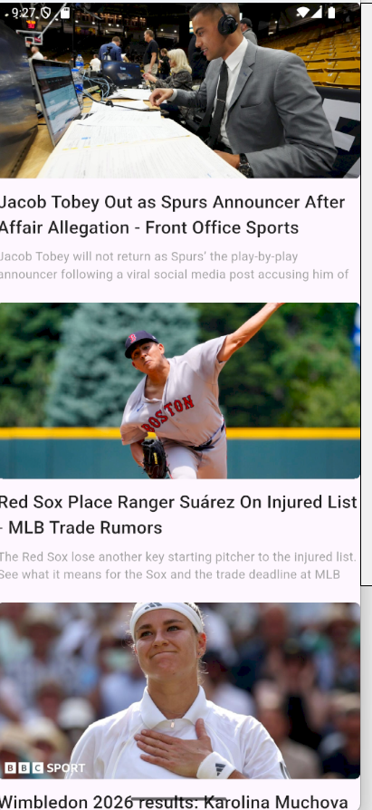

<div align="center">

# 📰 News App

### Stay Updated with the Latest Headlines

A Flutter application that fetches real-time news from different categories using **News API** and **Dio**, providing users with a fast, clean, and modern reading experience.


</div>

---

# 📖 About the App

**News App** is a modern Flutter application that allows users to browse the latest news from multiple categories.

The application retrieves live news articles using **News API** through the **Dio** package and presents them in a clean and responsive user interface.

Users can explore different categories, read article summaries, and open the original news source for the complete article.

---

# 🎯 Why News App?

Keeping up with current events should be fast and simple.

This application was built to provide a smooth news-reading experience by organizing articles into categories and loading real-time content through REST APIs.

The project also demonstrates API integration, networking, and asynchronous programming in Flutter.

---

# ✨ Features

- 📰 Browse Latest News
- 🌍 Multiple News Categories
- ⚡ Real-time API Integration
- 📱 Responsive User Interface
- 🖼️ News Images
- 📖 Article Description
- 🌐 Open Full Article in Browser
- 🚀 Fast Performance

---

# 🌐 API Integration

The application uses **News API** together with the **Dio** package to retrieve real-time news articles.

Articles are loaded dynamically based on the selected category, ensuring users always receive the latest headlines.

---

# 📱 App Screens

<div align="center">

|                       🏠 Home Screen                       |                   📰 News Screen                    |
| :--------------------------------------------------------: | :-------------------------------------------------: |
|  |  |

</div>

---

## 🏠 Home Screen

The Home Screen displays all available news categories such as Business, Sports, Technology, Health, Science, and Entertainment.

Users can easily browse categories and choose the type of news they are interested in.

---

## 📰 News Screen

The News Screen displays the latest articles for the selected category.

Each article includes:

- News Image
- Article Title
- Short Description

Users can tap on any article to open the complete news story in the browser and continue reading from the original source.

---

# 🏗️ Project Structure

The project follows a simple and organized architecture that separates business logic from the user interface.

```text
lib
│
├── models
│   ├── articles_models.dart
│   └── category_model.dart
│
├── services
│   └── news_service.dart
│
├── views
│   └── home_view.dart
│
├── widget
│   ├── category_card.dart
│   ├── category_view.dart
│   ├── categories_list_view.dart
│   ├── news_list_view.dart
│   └── news_tile.dart
│
└── main.dart
```

---

# 🛠 Tech Stack

| Technology      | Description                       |
| --------------- | --------------------------------- |
| Flutter         | Cross-platform Mobile Development |
| Dart            | Programming Language              |
| Dio             | HTTP Client for REST APIs         |
| News API        | Fetch Real-time News              |
| URL Launcher    | Open Articles in Browser          |
| Material Design | User Interface                    |

---

# 📦 Dependencies

- dio
- url_launcher

---

# 🚀 Getting Started

## Clone the Repository

```bash
git clone https://github.com/mohamedayman891/news_app.git
```

---

## Navigate to the Project

```bash
cd news_app
```

---

## Install Dependencies

```bash
flutter pub get
```

---

## Run the Application

```bash
flutter run
```

---

# 📂 Assets

```text
assets
│
├── image
└── screenshot
    ├── home_screen.png
    └── news.png
```

---

# 💡 Future Improvements

- 🔍 Search News
- ⭐ Bookmark Articles
- 🌙 Dark & Light Theme
- 🌍 Multi-language Support
- 🔔 Push Notifications
- 📱 Pull-to-Refresh
- ❤️ Favorite Categories

---

# 👨‍💻 Developer

## Mohamed Ayman

Flutter Developer

Passionate about building modern, scalable, and responsive Flutter applications.

<p align="left">

<a href="https://github.com/mohamedayman891">

</a>

<a href="https://www.linkedin.com/in/mohamed-ayman09">

</a>

</p>

---

<div align="center">

### ⭐ If you found this project useful, don't forget to leave a Star!

Made with ❤️ using Flutter

</div>
